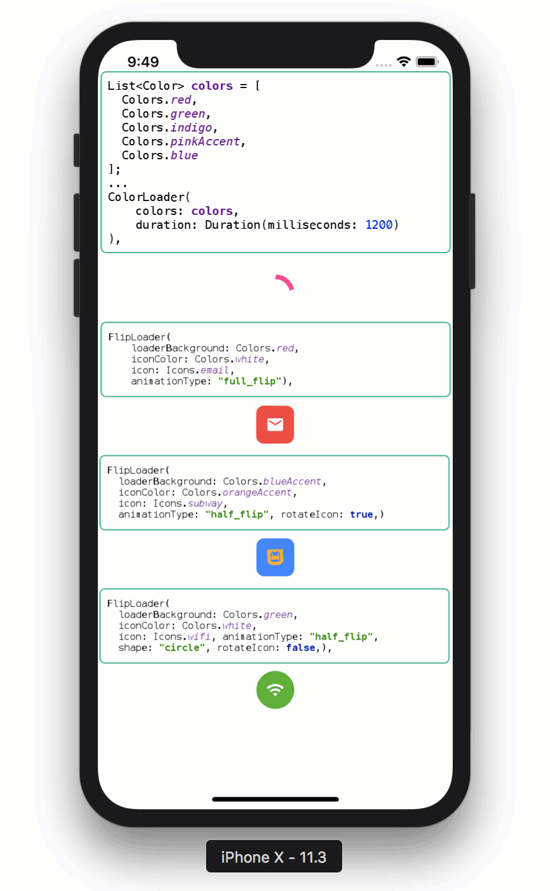

# Flutter Login Screens

A collection of Login Screens, Buttons and Loaders with attractive UIs, built with Flutter, ready to be used in your applications.

###### Last Update: Added Loaders

## Screenshots And Usage

## Loaders



`ColorLoader` requires `colors` and `duration` as mandatory parameters. `FlipLoader` and `FlipLoader2` do not require any parameters.

#### Color Loader
```
List<Color> colors = [
    Colors.red,
    Colors.green,
    Colors.indigo,
    Colors.pinkAccent,
    Colors.blue
];
 

//Use in widget tree
ColorLoader(
   colors: colors,
   duration: Duration(milliseconds: 1200)
),
```

#### Flip Loader
_Example #1_
```
FlipLoader(
  loaderBackground: Colors.red,
  iconColor: Colors.white,
  icon: Icons.email,
  animationType: "full_flip"),
```
_Example #2_
```
FlipLoader(
  loaderBackground: Colors.blueAccent,
  iconColor: Colors.orangeAccent,
  icon: Icons.subway,
  animationType: "half_flip",
  rotateIcon: true,
),
```
_Example #3_
```
FlipLoader(
  loaderBackground: Colors.green,
  iconColor: Colors.white,
  icon: Icons.wifi,
  animationType: "half_flip",
  shape: "circle",
  rotateIcon: false,
),
```
___
###### I am working on more loaders. These loaders will also be updated. Thanks to [jakeleveroni](https://github.com/jakeleveroni) for parameterizing the FlipLoader. 
___

## Buttons


#### Simple Round Button

```
SimpleRoundButton(
    backgroundColor: Colors.redAccent,
    buttonText: Text("LOGIN", 
        style: TextStyle(
            color: Colors.white
        ),
    ),
    textColor: Colors.white,
)
```

#### Simple Round Icon Button 

```
SimpleRoundIconButton(
    backgroundColor: Colors.orangeAccent,
    buttonText: Text("SEND EMAIL", 
        style: TextStyle(
            color: Colors.white
        ),
    ),        
    textColor: Colors.white,
    icon: Icon(Icons.email),
)
```

#### Simple Round Icon Only Button 
```
SimpleRoundOnlyIconButton(
  backgroundColor: Colors.blueAccent,
  icon: Icon(Icons.phone),
  iconAlignment: Alignment.center,
)
```
___
##Login Screens

### Login Screen 1


##### Usage

`Container(
    child: LoginScreen1(
        primaryColor: Color(0xFF4aa0d5),
        backgroundColor: Colors.white,
        backgroundImage: new AssetImage("assets/images/full-bloom.png"),
    ),
 )`
 
 ### Login Screen 2
 
 
 
 ##### Usage
 
 `Container(
     child: LoginScreen2(
       backgroundColor1: Color(0xFF444152),
       backgroundColor2: Color(0xFF6f6c7d),
       highlightColor: Color(0xfff65aa3),
       foregroundColor: Colors.white,
       logo: new AssetImage("assets/images/full-bloom.png"),
     ),
  )`
  
   ### Login Screen 3
   
   
   
   ##### Usage
   
   `Container(
       child: LoginScreen3(),
    )`
  
  ## Contribution and Donation
  
  Feel free to contribute. If you like the project and want to donate, [click here](https://www.paypal.me/samarthagarwal).

